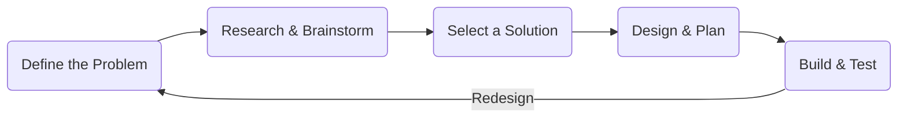

# Engineering Notebooks

## **The Goal For Engineering Notebooks**

Engineering notebooks should reflect back on previous thoughts, ideas, research material, decisions, and outcomes throughout the season. The notebook should allow us(and judges) to look at what worked and what didn’t, giving us a better understanding of how to tackle the next problems. You should always be writing your notebooks with this in mind. The Notebook should show some kind of uniqueness to your team. Many teams use VEX's template engineering notebook, which isn't awful, is only a place to start. You should immediately branch

## **The Engineering Design Process**

In order to problem-solve and make decisions optimally while covering all your note-taking bases, I recommend using the engineering design process to bring the most value in each design cycle. Color coding each step of the process makes it easier for judges to follow. The engineering design process covers all your basis in decision making, design, and testing.

The engineering design process consists of the following:

* Define the Problem: Describe the obstacles pertaining to parts of the game or issues faced with previous design decisions. Include the constraints and scope of the problem.
* Brainstorm + Research: Come up with potential solutions to the problem, incorporating research as inspiration and decision rationale.
* Select Solution + Plan: Decide on the design to implement, chosen through logical basis, prototyping, and previous iterations.
* Design + Build: Create the solution to the problem. Describe the thought process and decisions in detail.
* Test + Record Data: Test the developed solution and record results. Note the quality of implementation and viability.
* Iterate: Repeat the process as needed to refine the design.

## **Define the Problem:**

Defining the problem demonstrates that you know all the requirements in making this design and have thought extensively in what exactly it is that you are making. Requirements can include but are not limited to the following: Maneuverability, Weight, Ease of Building, Durability, Versatility.

## **Brainstorming + Research:**

Show every possible solution and design that you've come up with. Always include an image of what you've looked at since judges are mind readers and you aren't a poet. You need to explain why you nominated this solution and where it came from. Giving the sources of where you got it from is always a good idea. Taking inspiration from another team is fine as long as you showed your design in the design step.

## **Select Solution:**

Selecting a solution is the final step where you weighed each solution with its ability to fulfill the requirements declared in [Define the Problem](engineering_notebook.md#define-the-problem). Using a table chart with mechanisms vs. requirements is usually what happens but you can always be different. Some requirements are worth more than others, make sure to account of this and adjust it in your chart.

## **Design + Build:**

Showing the you created the solution can be as simple as showing cad drawings and schematics, and building pictures. There's not much to this other than showing that you did it and possible changes that may arise as you design it.

## **Testing**

Make sure to declare what it is that you are testing. What are the units? How are you testing it? Is there any variable that you are keeping between your test. How many trials did you do? Then what is it that this testing showed you? What can you take away from it?

**Last Updated: 03/19/26**
